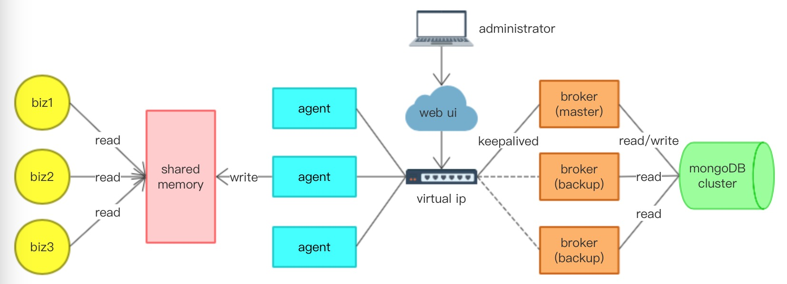

## Sona

Sona是一个go语言实现的高效、实时、高可用的linux分布式配置中心，支持（C/C++/Go/Java/Python）主流编程语言接口

```
    ___  ___  _ __   __ _ 
   / __|/ _ \| '_ \ / _` |
   \__ \ (_) | | | | (_| |   
   |___/\___/|_| |_|\__,_|   

```

## 特点

sona配置中心采用了经典一中心(broker)多agent的分布式架构，基于共享内存下发、存储各节点所需配置，为业务提供KV方式访问每个配置内容

- `高度可用`：agent即使挂掉也不影响已有业务读配置，而broker以keepalived组件保证其高可用
- `一致性`：broker采用主备模式，仅主对外服务，正常情况下保证数据完全一致；
仅在主备切换时可能有短时间最新数据的延迟。总体而言实现了数据的最终一致性
- `实时更新`：正常情况下，数据实时更新到各节点；仅在主备切换时刻，可能有短时间的数据延迟
- `API简单`：无配置文件概念，故业务无需关心配置文件解析；
数据实时更新对业务完全透明，业务无需编写配置更新的回调函数


## USAGE

提供C/C++/Java/Python/Golang多语言支持

go语言业务：

```
import "sona/api"

configApi, err := api.GetApi("nba.player.info") //获取nba.player.info服务的配置
if err == nil {
    defer configApi.Close()

    value := configApi.Get("lebron-james","number") //获取lebron-james.number值 (string)

    list := configApi.GetList("lebron-james","friends") //获取lebron-james.friends值列表 ([]string)
}
```

## 架构



## 安装

依赖：

1、mongoDB（可单点，但建议主备）

2、keepalived（可不安装，如果不在意broker单点的话）

安装流程：

- 将本项目git clone到您的`$GOPATH`下
- 进入`$GOPATH/sona`目录下
- 执行`make`进行编译，所有可执行文件sona_agent、sona_broker将产生在`bin`目录下
- 编辑broker配置文件（示例在`broker/conf/`目录下），后执行`bin/sona_broker -c 配置文件路径`启动broker
- 编辑agent配置文件（示例在`agent/conf/`目录下），后执行`bin/sona_agent -c 配置文件路径`启动agent
- 所有语言的api位于`api`目录下，自行使用即可


### keepalived说明

- `master_keepalived.conf`是主broker所在keepalived环境所需配置；需改名移动到`/etc/keepalived/`目录下
- `backup_keepalived.conf`是备broker所在keepalived环境所需配置；需改名移动到`/etc/keepalived/`目录下
- `broker_detect.sh`是检测broker是否正常服务的脚本，可在其中添加ping网关操作，用于防脑裂；需移动到`/etc/keepalived/`目录下
- `broker_detect.go`是检测broker是否正常服务的程序，运行`go build`编译生成可执行文件，由broker_detect.sh调用，需移动到`/etc/keepalived/`目录下
- `restart_service.sh`是服务挂掉后（非掉电），尝试周期性自动重启服务的脚本，建议作为crontab任务
